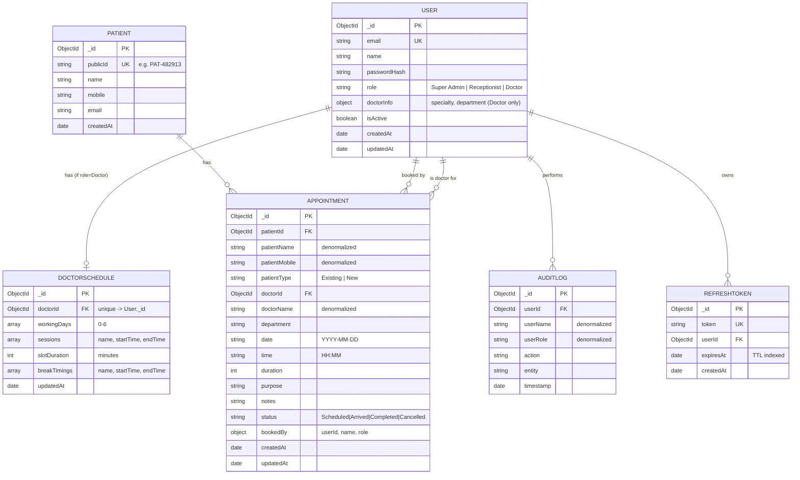

# Database Schema
## Enterprise EMR Appointment Management System — MongoDB / Mongoose

Database: MongoDB (single standalone instance is sufficient — no replica set required).
ODM: Mongoose.

---

## 1. Entity-Relationship Diagram



---

## 2. Collections

### `users`
Holds all three roles (Super Admin, Receptionist, Doctor) in one collection, discriminated by `role`. `doctorInfo` is only populated when `role === "Doctor"`.

| Field | Type | Notes |
|---|---|---|
| `_id` | ObjectId | Primary key |
| `email` | String | Unique, lowercase, indexed |
| `name` | String | |
| `passwordHash` | String | bcrypt hash, `select: false` (excluded from default queries), stripped from all JSON output |
| `role` | String (enum) | `Super Admin` \| `Receptionist` \| `Doctor`, indexed |
| `doctorInfo.specialty` | String | Doctor only |
| `doctorInfo.department` | String | Doctor only |
| `isActive` | Boolean | Default `true`; soft-disable instead of deleting |
| `createdAt` / `updatedAt` | Date | Auto (timestamps) |

**Sample document:**
```json
{
  "_id": "665f1a2b3c4d5e6f7a8b9c0e",
  "email": "doctor@emr.com",
  "name": "Dr. Gregory House",
  "role": "Doctor",
  "doctorInfo": { "specialty": "Infectious Diseases", "department": "Internal Medicine" },
  "isActive": true,
  "createdAt": "2026-06-01T08:00:00.000Z",
  "updatedAt": "2026-06-01T08:00:00.000Z"
}
```

---

### `doctorschedules`
One document per doctor. Separate from `users` because it's read on every slot-generation request and updated independently of the doctor's profile.

| Field | Type | Notes |
|---|---|---|
| `_id` | ObjectId | |
| `doctorId` | ObjectId → `users._id` | **Unique** — one schedule per doctor |
| `workingDays` | [Number] | `0`=Sunday … `6`=Saturday |
| `sessions` | [{ name, startTime, endTime }] | e.g. Morning/Evening sessions |
| `slotDuration` | Number | Minutes per slot (5–240) |
| `breakTimings` | [{ name, startTime, endTime }] | Slots overlapping these are never generated |
| `updatedAt` | Date | Auto |

**Sample document:**
```json
{
  "_id": "665f2b...",
  "doctorId": "665f1a2b3c4d5e6f7a8b9c0e",
  "workingDays": [1, 2, 3, 4, 5],
  "sessions": [
    { "name": "Morning Session", "startTime": "09:00", "endTime": "12:00" },
    { "name": "Evening Session", "startTime": "13:00", "endTime": "17:00" }
  ],
  "slotDuration": 15,
  "breakTimings": [{ "name": "Lunch Break", "startTime": "12:00", "endTime": "13:00" }],
  "updatedAt": "2026-07-01T09:00:00.000Z"
}
```

---

### `patients`
| Field | Type | Notes |
|---|---|---|
| `_id` | ObjectId | Internal primary key (used as `patientId` in bookings) |
| `publicId` | String | Unique, human-friendly (`PAT-482913`) — display/search only |
| `name` | String | Indexed |
| `mobile` | String | Indexed — primary lookup key for "existing patient" search |
| `email` | String | Optional |
| `createdAt` | Date | Auto |

---

### `appointments`
The core scheduling ledger.

| Field | Type | Notes |
|---|---|---|
| `_id` | ObjectId | |
| `patientId` | ObjectId → `patients._id` | |
| `patientName`, `patientMobile` | String | **Denormalized** from `patients` at booking time |
| `patientType` | String | `Existing` \| `New` |
| `doctorId` | ObjectId → `users._id` | |
| `doctorName`, `department` | String | **Denormalized** from `users` at booking time |
| `date` | String | `YYYY-MM-DD` — string, not `Date`, to avoid timezone drift in slot matching |
| `time` | String | `HH:MM` |
| `duration` | Number | Minutes, copied from the doctor's `slotDuration` at booking time |
| `purpose`, `notes` | String | |
| `status` | String (enum) | `Scheduled` → `Arrived` → `Completed` \| `Cancelled` |
| `bookedBy` | { userId, name, role } | Who made the booking |
| `createdAt` / `updatedAt` | Date | Auto |

**Sample document:**
```json
{
  "_id": "665f3c...",
  "patientId": "665f1a2b3c4d5e6f7a8b9c10",
  "patientName": "John Smith",
  "patientMobile": "9876543210",
  "patientType": "New",
  "doctorId": "665f1a2b3c4d5e6f7a8b9c0e",
  "doctorName": "Dr. Gregory House",
  "department": "Internal Medicine",
  "date": "2026-07-15",
  "time": "09:15",
  "duration": 15,
  "purpose": "Follow-up consultation",
  "notes": "",
  "status": "Scheduled",
  "bookedBy": { "userId": "665f4d...", "name": "Jane Doe", "role": "Receptionist" },
  "createdAt": "2026-07-11T08:00:00.000Z",
  "updatedAt": "2026-07-11T08:00:00.000Z"
}
```

**Why denormalized names?** Appointments are read (listed/searched/sorted) far more often than a doctor's or patient's name changes, and historical booking records shouldn't retroactively change if a name is edited later. Denormalizing avoids a `$lookup`/populate join on the hottest read path.

---

### `refreshtokens`
| Field | Type | Notes |
|---|---|---|
| `_id` | ObjectId | |
| `token` | String | Unique, indexed |
| `userId` | ObjectId → `users._id` | |
| `expiresAt` | Date | **TTL-indexed** — MongoDB auto-deletes the document once expired |
| `createdAt` | Date | Auto |

---

### `auditlogs`
Immutable trail — no update/delete operations are ever performed on this collection.

| Field | Type | Notes |
|---|---|---|
| `_id` | ObjectId | |
| `userId` | ObjectId → `users._id` | |
| `userName`, `userRole` | String | Denormalized at write time |
| `action` | String | e.g. `"Appointment Created"` |
| `entity` | String | e.g. `"Appointment: 665f3c..."` |
| `timestamp` | Date | Indexed, sorted descending for display |

---

## 3. Relationships Summary

```
User (Doctor) 1 ──── 1 DoctorSchedule
User (Doctor) 1 ──── * Appointment      (doctorId)
Patient       1 ──── * Appointment      (patientId)
User          1 ──── * Appointment      (bookedBy.userId)
User          1 ──── * AuditLog         (userId)
User          1 ──── * RefreshToken     (userId)
```

All relationships are referenced by ObjectId; there is no use of MongoDB's `$lookup` in the hot read path (appointment listing) because the frequently-displayed fields are denormalized directly onto `appointments`.

---

## 4. Indexes & Query Optimization Strategy

| Collection | Index | Purpose |
|---|---|---|
| `appointments` | `{ doctorId: 1, date: 1, time: 1 }` **unique, partial** (`status ∈ {Scheduled, Arrived, Completed}`) | **Double-booking prevention** — the core concurrency-safety mechanism. Two simultaneous booking attempts for the same doctor/date/time race at the MongoDB storage layer; only one insert can succeed, the other raises a duplicate-key error (`E11000`) which the API turns into `409 Conflict`. Cancelled appointments are excluded from the constraint so a freed slot can be rebooked. |
| `appointments` | `{ doctorId: 1, date: 1 }` | Fast lookup of a doctor's booked times for a given day during slot generation |
| `appointments` | `{ date: 1, status: 1 }` | Fast date-range + status filtering on `GET /appointments` |
| `appointments` | text index on `{ patientName, doctorName, patientMobile }` | Combined search box |
| `users` | `{ email: 1 }` unique | Login lookup, enforces one account per email |
| `users` | `{ role: 1 }` | Fast "list all Doctors" query |
| `doctorschedules` | `{ doctorId: 1 }` unique | One schedule per doctor, O(log n) lookup |
| `patients` | `{ mobile: 1 }` | Fast "existing patient" search by mobile |
| `patients` | text index on `{ name, mobile, publicId }` | Combined patient search |
| `refreshtokens` | `{ expiresAt: 1 }` TTL | Automatic cleanup of expired sessions — no cron job needed |
| `auditlogs` | `{ timestamp: 1 }` | Fast reverse-chronological listing |

**Query optimization strategy:**
- `GET /appointments` runs `find().sort().skip().limit()` and `countDocuments()` **in parallel**, both hitting the indexes above — no in-memory filtering of the full collection, which is what the original Firestore-based prototype did and does not scale.
- Slot generation only fetches `{ time: 1 }` (a lean projection) for booked appointments rather than full documents, since only the booked time values are needed.
- List/search results never require a `$lookup` join because doctor/patient names are denormalized onto `appointments` at write time.

---

## 5. Concurrency Handling — How Double-Booking Is Prevented

Booking is a single `Appointment.create(...)` call protected by the partial unique index described above. This was chosen over multi-document transactions because:

1. It's atomic by construction at the storage layer — no explicit read-then-write race window to reason about.
2. It works on a **standalone MongoDB server** (transactions require a replica set).
3. It removes an entire extra "lock" collection that a transaction-based approach would otherwise need.

See `ENGINEERING_DECISIONS.md` for the full reasoning and the scaling discussion for millions of appointments.
